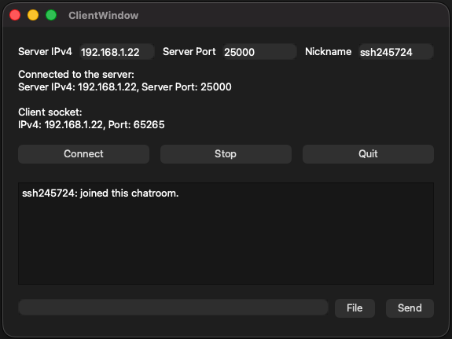

# Qt TCP Chat Client

A robust C++ desktop chat application built with the Qt Framework. This client supports real-time text messaging and file sharing over TCP/IP, featuring a custom binary protocol and a user-friendly GUI.

<div align="center">
    
    <p><em>image: client GUI</em></p>
</div>

## Features

- **Real-time Messaging**: Send and receive text messages instantly via TCP sockets.
- **File Transfer with Confirmation**: Attach files to your chat. A confirmation dialog (`FileSenderDialog`) prevents accidental transfers.
- **Nickname System**: Set a custom nickname to identify yourself in the chatroom.
- **Interactive Message Log**: View chat history in a formatted `QTextBrowser` with support for clickable file links.
- **Status Monitoring**: Real-time logging of socket states and connection errors.

## Tech Stack

- **Language**: C++
- **Framework**: Qt (Widgets, Network)
- **Build System**: CMake

## Project Structure

- `main.cpp`: Entry point of the application.
- `clientwindow.h/cpp/ui`: Main application logic and UI handling.
- `filesenderdialog.h/cpp/ui`: Confirmation modal for file uploads.
- `packetHeader.h`: Definition of the custom network protocol (Packet structure).

## Network Protocol

The application uses a custom binary header to ensure structured data exchange:

```cpp
typedef struct PacketHeader {
    ePacketType packetType;       // Heartbeat, TextMessage, or File
    quint32 packetSize;           // Size of the following payload
    char senderNickName[17];      // Null-terminated sender name
    char fileName[33];            // Null-terminated file name (for file packets)
} PacketHeader_t;